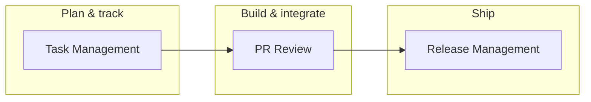

# AiNative

**Your engineering operating system** — workflows, reference, prompts, and rituals for how you build, review, ship, and lead.

Use it yourself first. Refine it in real work. Then bring the same playbook to each team you join.

Architecture spec: [ENGINEERING-OS.md](./ENGINEERING-OS.md)

---

## What this is

AiNative is not an application. It is a **structured repository of knowledge, decisions, and operational patterns** that compounds over time — versioned in Git, no external tools required.

It covers work you repeat on every team:

| Area | Where |
|------|--------|
| **Task management** | [docs/systems/task-management-system.md](./docs/systems/task-management-system.md) |
| **PR review** | [docs/systems/pr-review-system.md](./docs/systems/pr-review-system.md) |
| **Release management** | [docs/systems/release-management-system.md](./docs/systems/release-management-system.md) |
| **Client compatibility** | [docs/systems/client-compatibility-system.md](./docs/systems/client-compatibility-system.md) |
| **Commands & setup** | [docs/knowledge/](./docs/knowledge/) |
| **AI prompts & agents** | [docs/agents/](./docs/agents/), [agentic system](./docs/systems/agentic-system.md), [docs/systems/](./docs/systems/) |
| **Bug patterns, ADRs & incidents** | [docs/records/](./docs/records/) |

---

## Who this is for

- **You** — hybrid developer/manager owning the technical layer
- **Small teams** — same universal workflows; local context (board URL, approvers) stays in the project or `scratch/`

---

## How the systems connect



1. **Tasks** move through a clear board with ownership, WIP limits, and weekly planning/review.
2. **PRs** use staged AI-assisted review before human merge decision.
3. **Releases** follow a fixed branch flow: `feature/*` → `development` → staging → `master` → production.

---

## Getting started (personal)

1. **Read the OS spec** — [ENGINEERING-OS.md](./ENGINEERING-OS.md) (5 min)
2. **Cursor agents** — from this repo, `./scripts/setup-machine.sh` once, then `./scripts/setup-project.sh ~/path/to/app` for each app ([personal-agents-symlinks.md](./docs/knowledge/setup/personal-agents-symlinks.md))
3. **Use scratch** — `scratch/` is for temp files and agent working material (gitignored; see `scratch/README.md`)
4. **Pick one workflow** — start with [task management](./docs/systems/task-management-system.md) on one board
5. **Use PR review on your next change** — prompts in [pr-reviewer agent](./docs/agents/pr-reviewer/)
6. **Run Friday review** — promote scratch, update knowledge, delete junk (15 min)

After two weeks, add the next system. Do not introduce everything at once.

---

## Getting started (with others)

1. Share only systems you already run personally.
2. Run Monday planning and Friday delivery per the [task guide](./docs/systems/task-management-system.md).
3. Keep project-specific notes (board URL, approvers) in the project repo or `scratch/` — not in this repo.

---

## Three rituals

| Ritual | When | Action |
|--------|------|--------|
| Capture | During work | Write badly in `scratch/` |
| Friday review | Weekly, 15 min | Promote → right layer; update knowledge; delete |
| Event response | Bug / decision / incident | Debug note, ADR, or postmortem |

---

## Repository layout

```text
AiNative/
├── README.md
├── ENGINEERING-OS.md              # Architecture spec
├── .cursor/rules/                 # Cursor rules (incl. engineering-os, ai-rules)
├── scratch/                       # gitignored temp — README only is tracked
└── docs/
    ├── README.md
    ├── systems/                   # How you work — workflows + AI methodology
    ├── agents/                    # Per-task AI agents (AGENTS.md, SKILL.md, rule.md)
    ├── knowledge/                 # Evergreen knowledge, updated in place
    │   ├── setup/ commands/ architecture/
    │   └── snippets/              # Copy-paste code
    └── records/                   # Dated, append-only memory
        ├── debugging/ decisions/ postmortems/ evaluations/
```

Full index: [docs/README.md](./docs/README.md)

---

## Core principles

1. **Retrieval over storage** — if you cannot find it in ten seconds, it does not exist
2. **Capture now, organize Friday** — friction at capture time kills the system
3. **AI as partner, not authority** — you own the merge and the release
4. **One canonical location** — duplication is how systems rot
5. **Finish before you start** — fewer parallel items, smaller tasks

---

*AiNative — implement for yourself, then make every team you touch faster to understand, review, and ship.*
