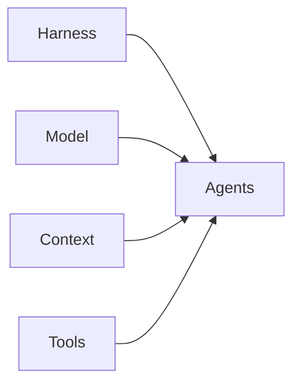

# Agentic system

Every agentic system has five parts. For managed projects, AiNative defines
the methodology and Hermes is the control plane that dispatches work through
its native Kanban board and worker profiles. That loop is **target design, not
wired into the current install**. Keep runtime configuration in Hermes and
project-specific context in the project.

| Part | What it is | Source of truth |
|------|------------|-----------------|
| [Harness](#1-harness) | Runtime and isolation for managed work | [feature-loop.md](./feature-loop.md), Hermes configuration |
| [Model](#2-model) | Model selection for each state | Hermes configuration |
| [Context](#3-context) | Project rules, specs, and methodology | Project `AGENTS.md`, `.ainative/project.yaml`, and this repository |
| [Tools](#4-tools) | Capabilities available to workers and control plane | Worker contract and Hermes configuration |
| [Agents](#5-agents) | Per-state skills and job-worker instructions | [agents/](../agents/) |

The target managed-project workflow is [feature-loop.md](./feature-loop.md)
(not wired into the current install). [agentic-coding.md](./agentic-coding.md)
documents the historical PIV methodology; do not treat it as a second live
workflow.

---

## 1. Harness

The managed-project runtime is the Hermes agent (the `personalAgent` install).
Hermes owns the board, worktree isolation, state transitions, human gates, and
publish decision. In the target design it starts one fresh worker session for
each agent state, in the task worktree; the current install has no worker loop
wired.

Workers return a compact report and exit. They do not own the workflow,
board, GitHub publishing, or deployment. Runtime details are in
[feature-loop.md](./feature-loop.md) and the `personalAgent` operator docs.

---

## 2. Model

Model choice is a system decision, not a default. Use different tiers for different work — and a **different model** for Validation than for Plan or Implementation ([validation-layer.md](./validation-layer.md#model-selection)).

Model names change as providers ship newer versions, so no specific model is pinned here. The tier **roles** stay stable; the concrete model is configured in Hermes (`config.yaml`) and may be overridden per task with `hermes kanban set-model` once dispatch is wired. A **default** model backs the personalAgent whenever it is not sure which tier fits.

| Tier | Role | Use for |
|------|------|---------|
| **0 — Default** | Fallback when unsure | Unclassified or ambiguous tasks — cheap, low-tier catch-all |
| **1 — Reasoning** | Planning, complex reasoning, interrogation | PIV Plan, ambiguous multi-file work, architecture decisions |
| **2 — Implementation** | Solid coding without full planning overhead | PIV Implementation, medium/small features, bounded changes |
| **3 — Execution** | Fast, cheap passes | Repetitive execution, small edits, high-volume loops |

**Rules:**

- Hermes configuration owns provider and model selection; card profiles name
  execution roles, not providers.
- Use distinct review models where the configured validation policy requires
  independent critic/tester review.
- Do not put provider names or credentials in project cards or AiNative
  agent definitions.

---

## 3. Context

What fills the context window — rules, project standards, and selectively loaded docs.

Project context is loaded from project-owned files and artifacts, using
progressive disclosure:

1. Index file + detail files so agents load only what they need.
2. Each detail file maps to a specific part of the code.
3. Keep files small — context window is for coding, not dumping the repo.

**Project rules** — keep stack, constraints, and working agreements in the
project's `AGENTS.md`. Declare workflow and validation commands in
`.ainative/project.yaml`.

**Methodology** — AiNative is mounted read-only at `/opt/data/mnt/AiNative`
for managed work. Project specifications and plans remain in the project
repository.

---

## 4. Tools

What agents invoke beyond generation — scoped narrowly so context stays clean.

| Tool | Scope | Owner |
|------|-------|-------|
| **Worker tools** | Read, edit, test, and inspect code for one assigned state | Hermes runtime configuration and worker contract |
| **Kanban / GitHub / messaging** | Cards, publish operations, and human notifications | Hermes control plane |
| **Project services** | Databases, payments, deployment, and other integrations | Project configuration and explicitly granted worker tools |

When using MCP, avoid poorly scoped server handling that fills context with tool metadata. Browser/E2E and other tools may be added here as the system grows.

---

## 5. Agents

Per-task workflows are folders with `AGENTS.md`, `SKILL.md`, and `rule.md`.
In the target design Hermes dispatches these definitions for required
feature-loop states or a named job card; no editor command or per-project
symlink is required.

| Agent | Managed-project role |
|-------|-----------------------|
| [ready](../agents/ready/) | Required feature-loop preflight |
| [critic](../agents/critic/) | Required adversarial review after converge |
| [tester](../agents/tester/) | Required project validation |
| [pr-reviewer](../agents/pr-reviewer/) | Required final review before publish |
| [project-bootstrapper](../agents/project-bootstrapper/) | Job-card setup for an enrolled, empty repo |
| [prd-writer](../agents/prd-writer/) | Optional PRD-writing job |
| [task-groomer](../agents/task-groomer/) | Optional card-grooming job |
| [scout](../agents/scout/), [plan-reviewer](../agents/plan-reviewer/) | Optional methodology; not live feature-loop states |

Agent library and file contract: [8. agents/README.md](../agents/README.md).

PIV methodology (Plan → Implementation → Validation loops, handoffs, commit plan): [agentic-coding.md](./agentic-coding.md).

---

## Related

- [records/evaluations/](../records/evaluations/) — candidates to test before updating Model, Tools, or Agents tables above
- [agentic-coding.md](./agentic-coding.md) — PIV methodology and AI layer (Context)
- [validation-layer.md](./validation-layer.md) — Validation architecture and model separation
- [agent-handoff-template.md](./agent-handoff-template.md) — structured handoffs between agents
- [feature-loop.md](./feature-loop.md) — target Hermes execution graph
- [new-project.md](../knowledge/setup/new-project.md) — project enrollment and bootstrap handoff
